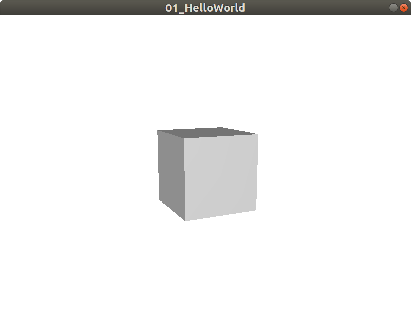

# Hello World

The aim of this tutorial is to:
1. Learn how to show a Window with 3D inside.
2. Add a box inside the 3D.
3. Place the box in screen.
4. Rotate the box to see the 3D.

After the tutorial we will obtain:



Complete code can be found at [Hello world](../../samples/jhelp/engine2/tutorials/HelloWorld.java)
in samples directory.

#### Step 1: Create the window for show the 3D

For create and show the window with 3D, we have two methods in `jhelp.engine2.render.Window3D`:
* `public static Window3D createFullWidow(@NotNull String title)`
  that will create a full screen window
* `public static Window3D createSizedWindow(int width, int height, @NotNull String title, boolean decorated)`
  that will create a window with given size. The decorated parameter
  indicates if show the title bar (and close button) of the button.

Since we have not already learn how close the window with code and not
learn to react to user events (keyboard and/or joystick and/or mouse events)
we will use the second method with decoration.

````java
    public static void main(String[] args)
    {
        //Step 1: Create the window for show the 3D
        Window3D window3D = Window3D.createSizedWindow(800,600,"01_HelloWorld", true);

        //...
    }
````

If we launch the code, we will see a white window.

The 3D is describe inside a scene (`jhelp.engine2.render.Scene`).
To do something with 3D, we get the scene

````java
        //Step 2: Obtain the 3D scene
        Scene scene = window3D.scene();
````

With a scene we can add 3D elements, change the background,
change the camera position and orientation.

We need an object to draw, now we choose a box:

````java
        //Step 3: Create the box
        Box box = new Box();

        //Step 4: Place the box in the scene
        scene.add(box);
````

If you launch the code like that, you will see nothing.
The cube is here, but we are inside. We will explain in next part,
the coordinate system. You have just to know now that by default,
the center of the box is placed at (0, 0, 0) with is corresponds exactly
where the camera is by default.
You may wonder why we don't see the inside of the box. The reason is, by
default, the face inside aren't rendered. Usually we look a box from outside
and so we never see the inside of the box. For optimize the rendering,
we don't render something never see. Note it is possible to ask to render
the inside of the box, we will se that in an other chapter.
For now we will just move the box far above the camera.
As we will see in coordinate system, behind the camera its positive Z and
in front camera is negative Z. So we use a negative Z to see the box:

````java
        //Step 5: Place the box in visible position
        box.position(0,0,-5);
````

If you launch the code like that you will see a light gray square in middle of white.
To see more  its 3D, we rotate a little bit the box (angles are in degree):

````java
        //Step 6: Rotate the box
        box.angleX(12);
        box.angleY(25);
````

*"Et voilà"* :)

This tutorial ends here, next one will explain the coordinate system