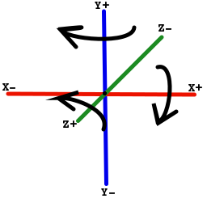

# Coordinate system

The OpenGL coordinate system is a classical Euclidean one:

The center of window 3D is placed at **(0, 0, 0.1)**.
The window plane is **XY** plane.
The window look towards the **Z-** direction.

> Note:
> * **X+** means positive value for **X** (abscissa)
> * **X-** means negative value for **X** (abscissa)
> * **Y+** means positive value for **Y** (ordinate)
> * **Y-** means negative value for **Y** (ordinate)
> * **Z+** means positive value for **Z** (depth)
> * **Z-** means negative value for **Z** (depth)
> * Coordinates in 3D are 3 numbers in parenthesis **(X, Y Z)**

The part of scene we can see through the window is a truncated pyramid
called a frustum:

[More images](https://duckduckgo.com/?q=3D+frustrum&t=canonical&iax=images&ia=images)

The window is the yellow part (Near part) at -0.1 for **Z**
For information, the far part is placed at -5000 for **Z**
The camera is at **(0, 0, 0)**

It is possible to rotate an object around **X**, **Y** or **Z** axis:

Angles are expressed in degree.
The arrows in schema shows the positive angle of rotation.

Each 3D element can be placed at a given position or translate.
Translation change position relatively to current position.
The same idea goes for angles, they can be specified specifically
or apply relatively through rotation.
Each 3D element extends [jhelp.engine2.render.Node](../../src/jhelp/engine2/render/Node.java)
List of methods for change nodes position/rotation/size:
* `public void position(final float x, final float y, final float z)`:
  Localize a node at given position
* `public void translate(final float x, final float y, final float z)`:
  Translate the node. In other words, move it relatively to its current position.
* `public void angleX(final float angleX)`: Define the angle (in degree)
  around X axis
* `public void rotateAngleX(final float angleX)`: Rotate node around X axis
* `public void angleY(final float angleY)`: Define the angle (in degree)
  around Y axis
* `public void rotateAngleY(final float angleY)`: Rotate node around Y axis
* `public void angleZ(final float angleZ)`: Define the angle (in degree)
  around Z axis
* `public void rotateAngleZ(final float angleZ)`: Rotate node around Z axis
* `public void setScale(final float x, final float y, final float z)` or
  `public void setScale(final float scale)` change node size
* `public void scale(final float x, final float y, final float z)` or
  `public void scale(final float scale)` scale the node

Try some combination on box in **Hello world** tutorial to understand more easy.
By example see effect of `box.scale(2, 1, 0.5f);`

*"Et voilà"* :)

This tutorial ends here, next we will put some colors with materials.

