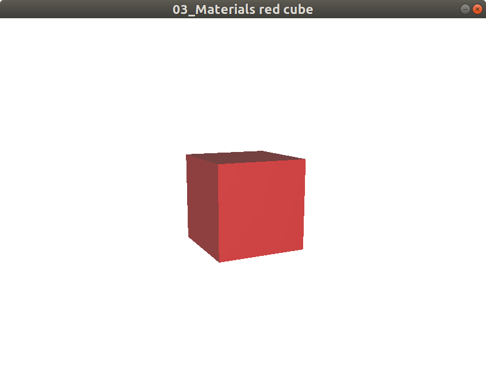
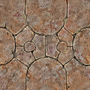
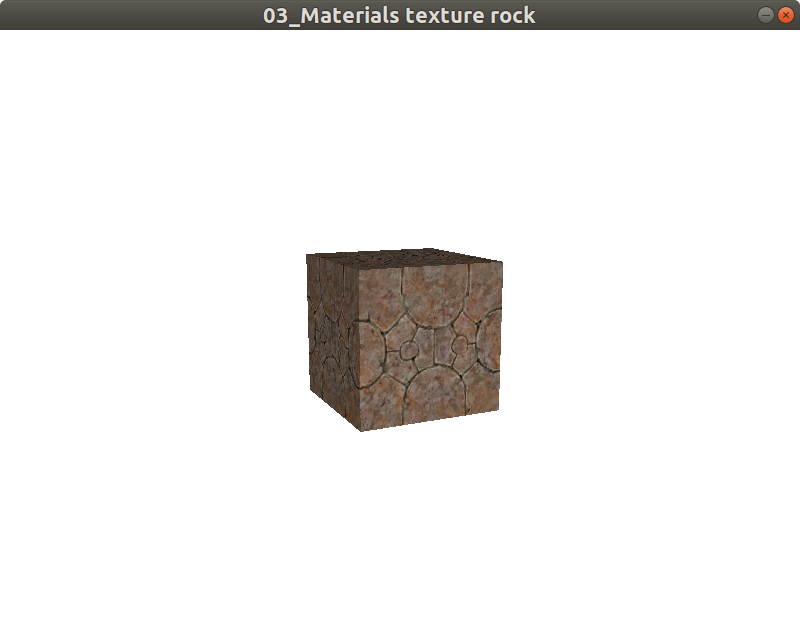
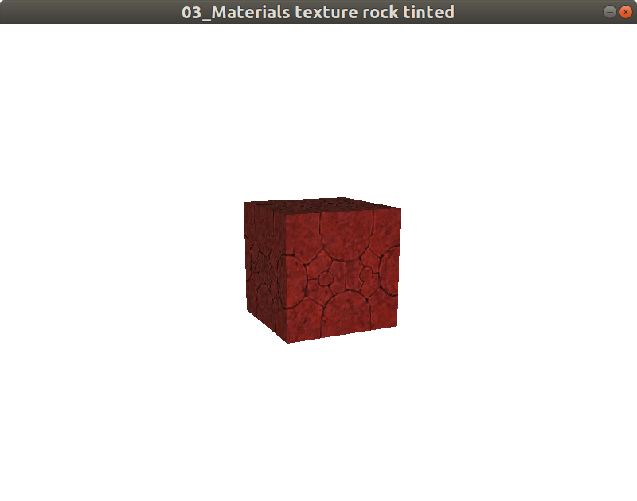
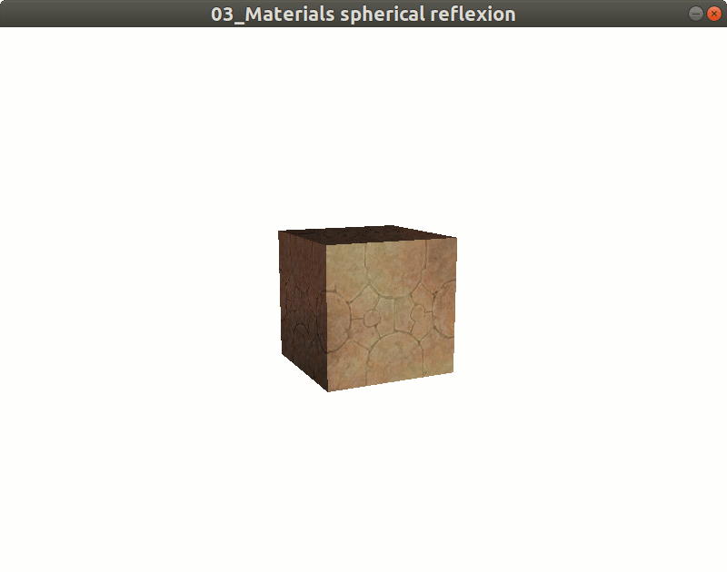

# Materials

Have a gray box, its cool, but it its not very fun.
We would like to add some colors or draw an image on it.
The material notion is here to make things more beautiful.

### What is a material ?

A material describes how render one or several objects in 3D.
A material is separate from 3D objects to be able to be applied to several of them.
A material specify object color
**and/or** image (texture) draw on object
**and/or** how light react to object
**and/or** specify reflection on object

### Colored cube

The aim here is to obtain a colored cube like:



Complete code at: [Red cube code](../../samples/jhelp/engine2/tutorials/MaterialRedCube.java)

From "Hello world" tutorial, we create a material:

````java
        //Create material
        Material material = new Material("Red");
````

The name of the material must be unique for all application.
The main part of material is called **diffuse**.
We want red cube, so we use red color on diffuse part:

````java
        //Use red color
        material.colorDiffuse(Color4f.DARK_RED);
````

> Note: Other parts change light reaction on 3D object.

Now we have to apply the material to the box:

````java
        //Apply material
        box.material(material);
````

### Textured cube

Now we will apply this image to cube:



to make it look like rock:



Complete code at: [Rock cube code](../../samples/jhelp/engine2/tutorials/MaterialTexture.java)

To use an image, in 3D we use a texture. Texture can be build from image or
unified color. It is possible to draw in a texture or transform it to make
an animation on it.

````java
        //Create material
        Material material = new Material("Rock");

        try
        {
            //Load the texture
            Texture texture = new Texture("Rock", Texture.REFERENCE_RESOURCES,
                                          MaterialTexture.class.getResourceAsStream("TextureRock.png"));

            //Define material texture:
            material.textureDiffuse(texture);
        }
        catch (Exception exception)
        {
            Debug.exception(exception, "Failed to load the texture");
        }
````

Like previously we create the material.
Then we load the texture in memory.
Then associate the texture to material. And we apply the texture.

> Note:
>  * Remember texture are heavy things. So reuse the same one every time it is possible.
>  * It is possible to free the memory taken by texture when this texture
will not be used again with `public void removeFromMemory(final @NotNull Texture texture)`
or `public void removeFromMemory(final @NotNull String textureName)` of
`jhelp.engine2.render.Window3D`


### Textures and colored cube

Now we will combine the two last examples to obtain:



Complete code at: [Red rock cube code](../../samples/jhelp/engine2/tutorials/MaterialTextureTinted.java)

From last example we just add red color to the material:

````java
        //Use red color
        material.colorDiffuse(Color4f.DARK_RED);
````

With this, the same texture instance can be used in different materials,
one red, other green, other blue, ....

### Spherical reflexion

Spherical reflexion used to simulate environment reflexion on an object.
Imagine we are inside a big ball and the inside reflect on the object.

Spherical reflexion is composed of a texture and a rate of influence.

More the spherical reflection have influence, more reflection is visible,
less diffuse color and/or texture are visible.

Less the spherical reflection have influence, less reflection is visible,
more diffuse color and/or texture are visible.

Start from textured rock box, we will obtain:



Complete code at: [Spherical reflexion code](../../samples/jhelp/engine2/tutorials/MaterialTextureSpheric.java)

For this we load the texture, then use it as spherical reflection.
We adjust the influence of reflexion at **"0.5"** to see combination diffuse and spherical.

````java
            //Load texture for spherical reflexion
            texture = new Texture("Emerald", Texture.REFERENCE_RESOURCES,
                                  MaterialTextureSpheric.class.getResourceAsStream("emerald.jpg"));
            //Define the spherical texture
            material.textureSpheric(texture);
            //Specify spherical reflexion influence
            material.sphericRate(0.5f);
````

> Note: In complete code we add an animation to able see the reflexion effect.
  Animations will be explain in an other chapter.

TODO other examples ? (Cubic ?)

### Additional information

If you look `jhelp.engine2.render.Material` class, you will see notions
that we don't already talk about:
* **Ambient**: Ambient is the color of an object where it is in shadow.
* **Emissive**: Emissive is the color emit by the object, like self illumination
* **Specular**: Specular is the bright spot of light that appears on shiny objects when illuminated.
                It is composed of a color and spot size defined by a level
* **Shininess**: Object shininess. Have influence in specular
* **Transparency**: Defines how much transparent an object is.
* **Two sided**: Indicates if have to draw the inside face or not.
                 For optimisation it is recommended to not render faces never see.
                 But, like plane, it is use full, sometimes, to be able see the two faces.
                 To know witch side is outside (always visible) or inside (optionally visible)
                 OpenGL look the order of point on a face. (Clockwise or counter-clockwise)

> Note: If you want try ambient, emissive, specular or  shininess effects,
  we recommend to use a sphere instead of box. Those effects are more visible
  on rounded object.

Combine everything is always possible. For test lot of combination more easily,
we recommend to look the chapter about keyboard/mouse/joystick management
and/or chapter about 2D object and UI.

> Note: Every change on material are updated "immediately".
  In fact things aren't synchronized, the change will be applied on next
  OpenGL render loop. But, except for very heavy scene, the OpenGL render
  loop goes very fast, so it seems "immediate".
