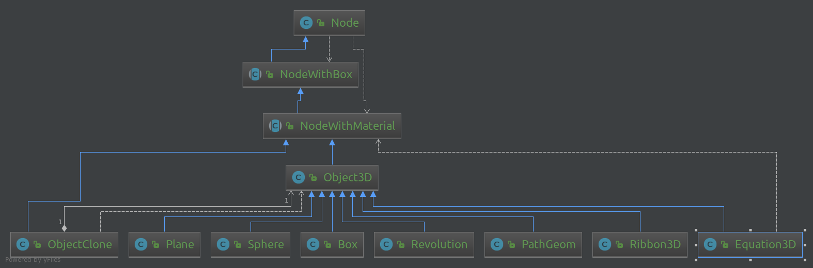

# Node hierarchy

Here we will see two different notions of hierarchy:
* One is relative to object programming
* Other one is relative to hierarchy in the scene organization

### Hierarchy from object programming point of view

Every thing draw in 3D inherits from `jhelp.engine2.render.Node`.
Every **Node** have a 3D position (X, Y, Z), angle around X, Y Z and scale
factors (see [Coordinate System chapter](02_CoordinateSystem.md)).
Like we will see on next part, they have or not a parent, and zero, one,
or several children.
The can be show or hide.
They can receive mouse event (See chapter about keyboard/mouse/joystick events)

Object programming hierarchy:

Where:
* **NodeWithBox**: Additional bounding box. Can be use for collision detection
* **NodeWithMaterial**: Use material to be rendered
* **Object3D**: Describe a generic 3D object with a mesh (set of face)
* **ObjectClone**: Reuse an **Object3D** mesh to be rendered.
                   They are use to duplicate lot of time the same object
                   in order to have only one time its mesh in CPU and GPU memory.
* **Plane**: Plane representation (Only a part of a plane)
* **Box**: A box/cube
* **Sphere**: A sphere/ball
* **Revolution**: Its a path turn around Y axis. Used by example for
                  bottle, vase, jar, ... Every object repeat them self around an axis.
* **Equation3D**: Parametric 3D equation depends on **"t"**.
                  An equation for each coordinate **X**, **Y** and **Z**
* **Ribbon3D**: Ribbon with given number of torsion.
* **PathGeom**: One path walk along an other path to make the object.

### Hierarchy from scene organization point of view

In scene organization, each node have a parent.
When we add a Node in scene directly, the node become the child of a
special Node: The scene root node. When a node is placed,
the coordinates, rotations or scales are relative to its parent.
With this it is possible to transform the node parent and it affects its
children, grand children, ...
By example, for a simple bicycle, create a node called bicycle, and add
it three children: two wheels and one body. So each time we transform
the node bicycle, wheels and body will inherits the same transformation.
But the opposite is false. By example we animate wheels to turn,
it didn't affect the bicycle node, nor body node.
It can simplify animations, make wheels turn in one animation,
and move the bicycle in other one without taking care wheels rotation.

An illustration can be found at:

[Bicycle code](../../samples/jhelp/engine2/tutorials/Bicycle.java)

> Note : Don't worry if you don't understand what is a quadratic or
  what is exactly a revolution. We will explain that in advanced tutorials.
