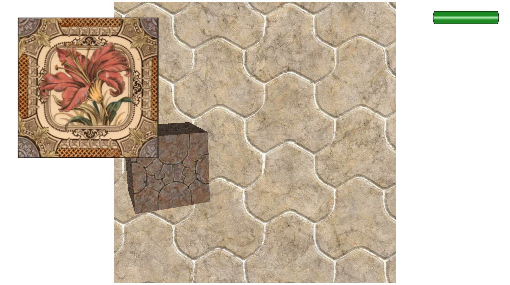
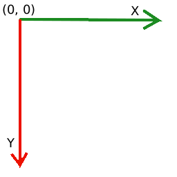
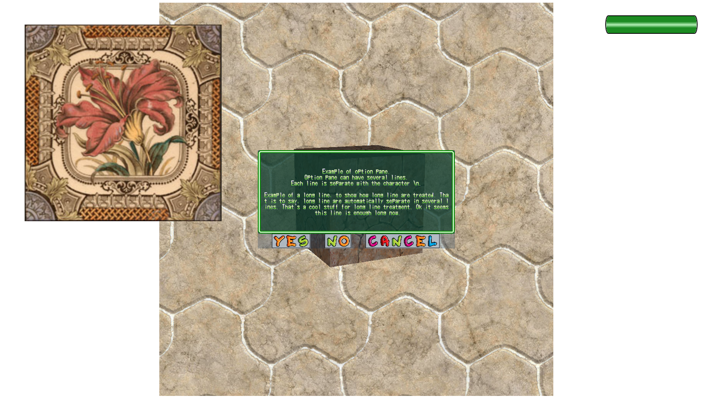

# User interface 2D

Sometimes it may useful to add an image over the 3D (By example for show a menu)
or under the 3D (By example for background)

Tutorial complete code: [Complete code](../../samples/jhelp/engine2/tutorials/UI2D.java)

We will do:



We start from keyboard/joystick tutorial
To manipulate the 2D, we take the 2D manager:

````java
        //Obtain object for manage 2D
        GUI2D gui2D = UI2D.window3D.gui2d();
````

Coordinates in 2D are screen coordinate in pixel:



The left up window corner is the (0, 0).
X goes from left to right.
Y goes from up to down.
The limit depends on window size.

We get window size:

````java
        //Get window 3D size
        int width  = UI2D.window3D.width();
        int height = UI2D.window3D.height();
````

We create a 2D object to put over the 3D. In other words even if object
are very near the window the 2D object is always over.

````java
        // Create a 2D object and put it over the 3D
        Object2D over = new Object2D(64, 64, 512, 512);
        gui2D.addOver3D(over);
````

The 2D object is not still visible, because it doesn't know what to draw.
To see it, we give it a texture:

````java
            //Load textures and apply them to 2D objects
            Texture texture = new Texture("Floor", Texture.REFERENCE_RESOURCES,
                                          UI2D.class.getResourceAsStream("floor.jpg"));
            over.texture(texture);
````

Move the box around the 2D object to see 2D object is always over.

Now we put a 2D object under the 3D. So it will be on background:

````java
        // Create a 2D object and put it under the 3D
        Object2D under = new Object2D((width - 1024) >> 1, (height - 1024) >> 1, 1024, 1024);
        gui2D.addUnder3D(under);

// ...

            texture = new Texture("Tile", Texture.REFERENCE_RESOURCES,
                                  UI2D.class.getResourceAsStream("tile1.jpg"));
            under.texture(texture);
````

Test again and see that the new objzct is on back ground.

It is also possible to add a button.
Button is made with 3D image, one when mouse out, on when mouse over the
button and one when click on the button. When created it can be put over
or under the 3D.

````java
            JHelpImage buttonNormal = JHelpImage.loadImage(UI2D.class.getResourceAsStream("Button_normal.png"));
            JHelpImage buttonOver   = JHelpImage.loadImage(UI2D.class.getResourceAsStream("Button_over.png"));
            JHelpImage buttonClick  = JHelpImage.loadImage(UI2D.class.getResourceAsStream("Button_click.png"));
            Button2D button2D = new Button2D(UI2D.BUTTON_ID,
                                             width - 256 - 32, 32, 256, 64,
                                             buttonNormal, buttonOver, buttonClick);
            gui2D.addOver3D(button2D);
````

We loaded the three images, constructed the button with those images and
add it over the 3D.

Launch again and see mouse interaction with the button.

---

Now we will add an option pane to have:



Option panes are dialog box composed of a text area for the message and
one, two or three buttons.

It is recommended to reuse the same instance of option pane each time its
possible. In fact the only case or several option panes are necessary is
when we want show several option pane in same time.

Create the option pane:

````java
        //Add an option pane
        OptionPane2D optionPane2D = new OptionPane2D(UI2D.window3D,
                                                     (width - 512) >> 1, (height - 256) >> 1, 512, 256,
                                                     UI2D::optionPaneClicked);
````

The listener given is called each time user click one of option pane button.
Notice that we have not specified the text message, nor the buttons.
It is an empty structure, ready to show something.

Show example:

````java
        //Show option pane dialog
        optionPane2D.showOptionPane(
                "Example of option pane.\nOption pane can have several lines.\nEach line is separate with the character \\n.\n\nExample of a long line, to show how long line are treated. That is to say, long line are automatically separate in several lines. That's a cool stuff for long line treatment. Ok it seems this line is enough long now.",
                OptionPaneButtons.YES_NO_CANCEL,
                UI2D.OPTION_PANE_ID);
````

Possible buttons are (Values from [OptionPaneButtons](../../src/jhelp/engine2/twoD/OptionPaneButtons.java))

|Value        |Meaning                                                       |
|-------------|--------------------------------------------------------------|
|OK           |Only an OK button, usually for informative message            |
|YES_NO       |Question message with two options: YES or NO                  |
|YES_NO_CANCEL|Question message with possibility to cancel the current action|

The ID given identify the message on dialog, to know when user press a button
which dialog is validated, refused or canceled.

-------------------

Practice:

Change the code to when user press escape key (exit button), option pane
show to ask if really want exit and exit only if yes is answered.

> Note: The solution is somewhere in the samples

