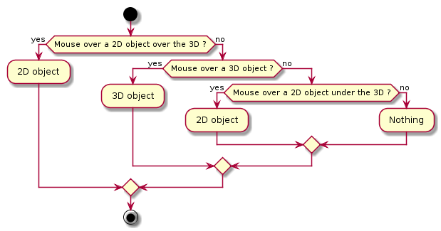

# Mouse events

In window 3D, mouse cursor can be over a 3D object, a 2D object or nothing.

To know over which element mouse is, the folow algorithm is applied



A 2D or 3D objects can decided to be not ignored by mouse.
In that case, this 2D or 3D object not count in previous algorithm and may
be an other 2D or 3D object behind him is detected.

The order detection for 2D object depends of the order they where added.
Last to first.

For 3D objects the engine compute the nearest object to window 3D under
the mouse pointer.

Each 2D/3D objects can register listeners to alert when mouse event happen
on them:

* For 2D the interface to implements is: [jhelp.engine2.twoD.event.Object2DListener](../../src/jhelp/engine2/twoD/event/Object2DListener.java)
* For 3D the interface to implements is: [jhelp.engine2.render.event.NodeListener](../../src/jhelp/engine2/render/event/NodeListener.java)
* For detect click that are in space, that is to say when click their no
  2D or 3D object under the mouse pointer, the interface to register to
  window 3D is: [jhelp.engine2.render.event.ClickInSpaceListener](../../src/jhelp/engine2/render/event/ClickInSpaceListener.java)

It exists a special mode that permits to detect approximately the mouse
position on diffuse texture of 3D object. We recommend to start this mode
just after a click on 3D object we want start the mode for.
And we recommend to stop this mode just after the detection.

Start the mode:

````java
            node.pickUVlistener = this;
            Mouse.window3D.pickUVnode(node);
````

Just before start the precise detection mode, we register the callback to
use when relative coordinate are computed.

And in the callback:

````java
        /**
         * Call when UV is pick
         *
         * @param u    U pick : [0, 255]
         * @param v    V pick : [0, 255]
         * @param node Node pick
         */
        @Override public void pickUV(final int u, final int v, final Node node)
        {
            Mouse.window3D.disablePickUV();
            node.pickUVlistener = null;
            Debug.information(node.nodeName, " (", u, "<>", u / 256f, " ; ", v, "<>", v / 256f, ")");

            // ...

         }
````

As recommended we start by deactivate the special detection mode.

The couple (u, v) received aren't texture coordinates, they are an integer
in [0, 256[ so have to divide by `255f` to have approximate of texture
coordinate. For a texture, computing coordinates can be do by:

````java
                        float width  = texture.width();
                        float height = texture.height();
                        int   x      = (int) ((u * width) / 255f);
                        int   y      = (int) ((v * height) / 255f);
````

Complete code at: [Mouse sample code](../../samples/jhelp/engine2/tutorials/Mouse.java)
