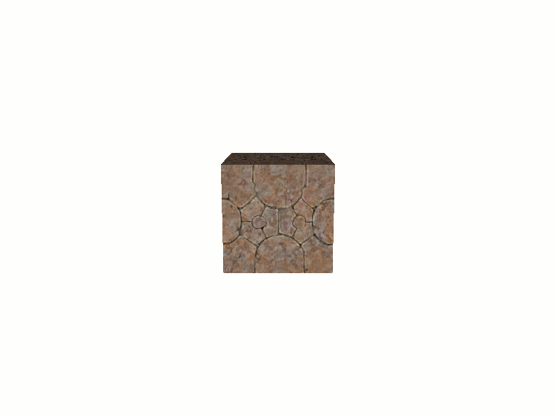
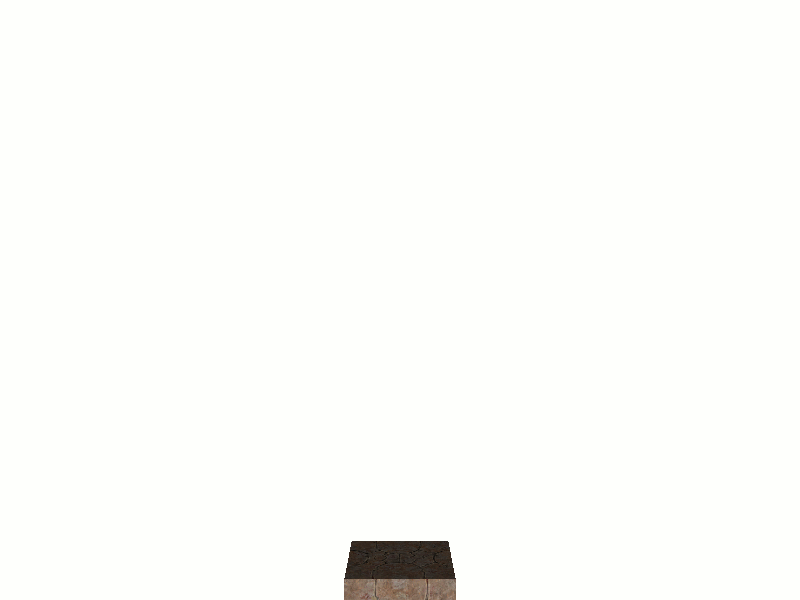
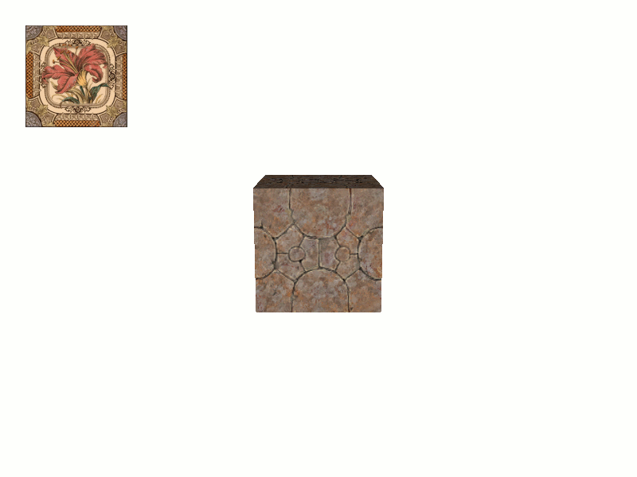
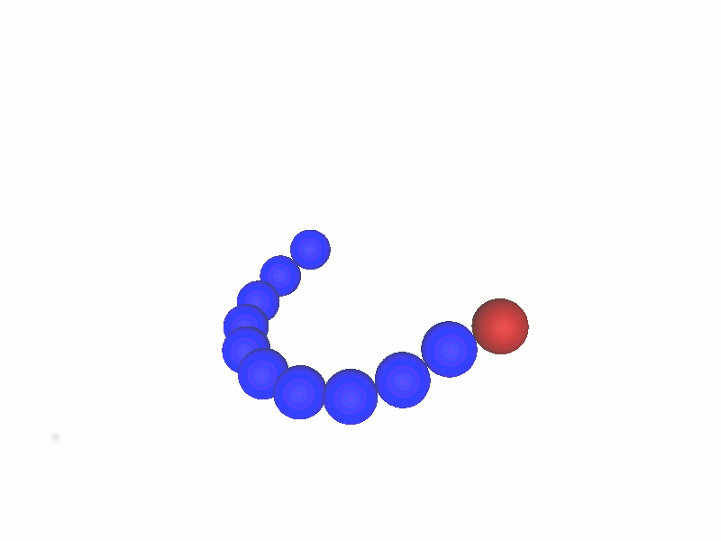
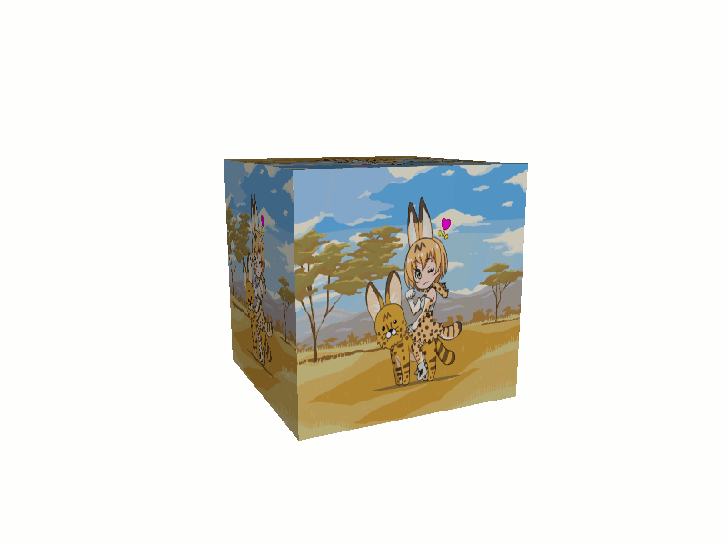

# Animations

Animations describes how move/transform 2D/3D objects or textures during
a period of time.

Animations implements the interface [jhelp.engine2.animation.Animation](../../src/jhelp/engine2/animation/Animation.java)

Animations are sequenced by frames. When an animation is start, the method
`void startAbsoluteFrame(float startAbsoluteFrame)` is called.
The given frame is the number of animation frame since window 3D is launched.
Then each time the animation is updated the method `boolean animate(float absoluteFrame)`
is called. The given frame is the number of animation frame since window
3D is launched, a simple subtraction with the number given at start gives
the number of frame since the animation started. The returned `boolean`
indicates if animation continues or not. That is to say: returns `true`
means that the animation is not finished, `false` means animation is finished.

For start animation, use one of `playAnimation` methods on Window3D.
To stop an animation immediately the method `stopAnimation`

### Animation loop

For simple cases it is possible to use [jhelp.engine2.animation.AnimationLoop](../../src/jhelp/engine2/animation/AnimationLoop.java)

To create an instance need something that extemnds its embed `AnimationLopp'
interface. This time, only one method to implements with number frame
since animation started as parameter.

The **shortcut** `public Animation playAnimation(final @NotNull AnimationLoop.AnimateLoop animateLoop)`
create automatically, the [jhelp.engine2.animation.Animation](../../src/jhelp/engine2/animation/Animation.java)
instance (Returned by the method).

Example at: [AnimationAnimationLoop](../../samples/jhelp/engine2/tutorials/AnimationAnimationLoop.java)



### Animation equation

It is possible to say to a 3D node to follow a 3D parametric equation.
It is composed of 3 equations, one for each axis X, Y and Z.
The parameter of each equation is always **`t`**

For say the node follow a knot way, equation:

> X(t) = sin(t) + 2 sin(2t)
>
> Y(t) = cos(t) - 2 cos(2t)
>
> Zt) = -sin(3t)

Where **`t`** from **-&pi;** to **&pi;**:

````java
        AnimationEquation animationEquation = new AnimationEquation(Function.parse("sin(t)+2*sin(2*t)"), // X(t)
                                                                    Function.parse("cos(t)-2*cos(2*t)"), // Y(t)
                                                                    Function.parse("-sin(3*t)"),         // Z(t)
                                                                    -Math3D.PI, Math3D.PI,
                                                                    200,
                                                                    box);
````

Example at: [AnimationAnimationLoop](../../samples/jhelp/engine2/tutorials/AnimationAnimationEquation.java)



### Animation key frame

Animations based on key frame are animation that decide the status of a
value at given frames and interpolate the value for frames between.

Example at: [AnimationAnimationKeyFrame](../../samples/jhelp/engine2/tutorials/AnimationAnimationKeyFrame.java)



### Node chain

Animation that link several object to one in chain. Place the main node,
then followers. And after that, just move the main one. The other members
of the chain will follow every main movement.

Example at: [AnimationNodeChain](../../samples/jhelp/engine2/tutorials/AnimationNodeChain.java)



### Texture gif

Texture with GIF animation on it.

Example at: [Texture GIF](../../samples/jhelp/engine2/tutorials/AnimationTextureGif.java)



### Texture font gif

Texture with text write with animated gif.

Example at: [Texture font GIF](../../samples/jhelp/engine2/tutorials/AnimationTextureFontGif.java)


### Texture transition

Animate a transition between two textures of same dimensions.

Example at: [Texture transition](../../samples/jhelp/engine2/tutorials/AnimationTextureTransition.java)


### Animation combination

Animations can be combine inside group where animations are played one
after other or in parallel.

For create a group of animations played in parallel : [jhelp.engine2.animation.AnimationParallel](../../src/jhelp/engine2/animation/AnimationParallel.java)

Fro create a group of animations played one after other, can be looped
several times: [jhelp.engine2.animation.MultiAnimation](../../src/jhelp/engine2/animation/MultiAnimation.java)

If in sequence of animation need to make a pause (Animation that does nothing
during a number of frame): [jhelp.engine2.animation.AnimationPause](../../src/jhelp/engine2/animation/AnimationPause.java)

If need launch a task when reach a moment in animation: [jhelp.engine2.animation.AnimationLaunchThread](../../src/jhelp/engine2/animation/AnimationLaunchThread.java)

