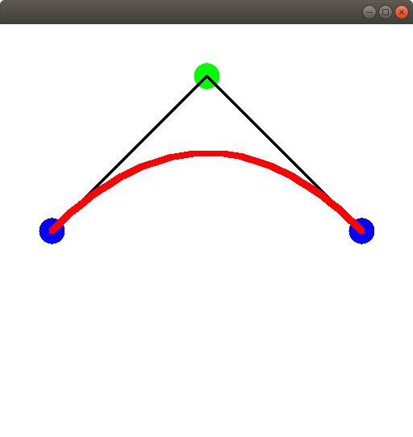
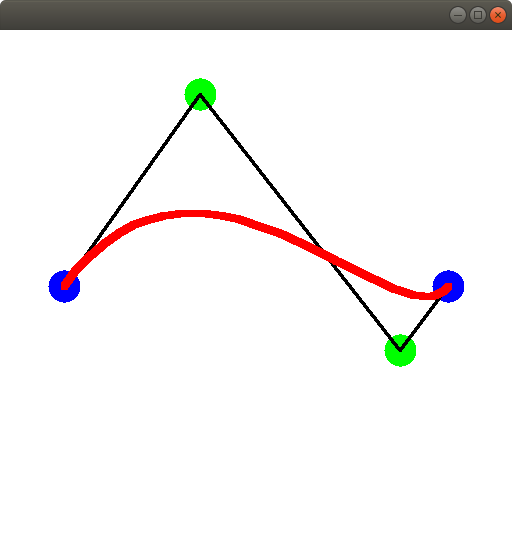
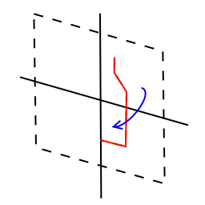

# Geometry

In package `jhelp.engine2.geometry` their easy to understand classes like
Box, Sphere or Plane.

Some other are little bit more tricky.

Lot of them use notion of 2D path.
2D path are made of part of line, cubic and/or quadratic.
See [jhelp.engine2.twoD.Path](../../src/jhelp/engine2/twoD/Path)

Quadratic are Bezier shape looks like:

> Where the red part will be the draw path.
> Blue points are start and end point.
> Green point is the control point
> Black line here show the tangents

Cubic are Bezier shape looks like:

> Where the red part will be the draw path.
> Blue points are start and end point.
> Green points are the control points
> Black line here show the tangents

### Revolution

A revolution is a 2D turn around the Y axis.
For example a bottle:

In red will be the 2D path turns around Y axis

[jhelp.engine2.tutorials.GeometryRevolution](../../samples/jhelp/engine2/tutorials/GeometryRevolution.java)

### Path geometry

Path repeated along an other path:

[jhelp.engine2.tutorials.GeometryPathGeom](../../samples/jhelp/engine2/tutorials/GeometryPathGeom.java)

### Equation 3D

A path is repeated along a 3D equation:

[jhelp.engine2.tutorials.GeometryEquation3D](../../samples/jhelp/engine2/tutorials/GeometryEquation3D.java)

